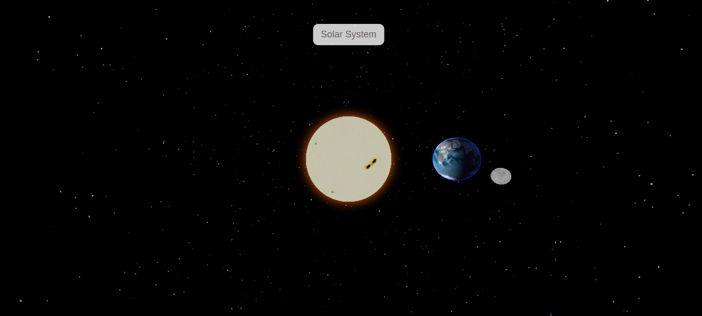

# 🌍 Solar System with THREE.js

This is a minimal yet juicy **Three.js** project visualizing a **basic solar system** with:

- ☀️ The Sun (with a glowing halo)
- 🌍 The Earth (rotating and orbiting the Sun)
- 🌑 The Moon (orbiting the Earth, and casting an eclipse shadow)

It's my **first project with Three.js**, created as both a tribute and an extension of the original [tutorial-based fork](#-credit--original-source).  
I've added extra realism, interactivity, and am working on simulating **solar eclipses**, where the Moon casts a shadow on the Earth.

---

## 🚀 Live Demo

> [Watch the original tutorial on YouTube](https://youtu.be/FntV9iEJ0tU)  
> _(This project is forked from that video and built upon it)_

---

## 📸 Screenshot

<p align="center">
  
</p>

---

## 🌌 Features

- Real-time **Earth rotation**
- **Earth orbiting** around the Sun
- **Moon orbiting** the Earth
- Simulated **Sunlight** using `DirectionalLight`
- **Sun glow** effect using shaders
- Moon set up to **cast shadows** on the Earth (solar eclipse)
- Background starfield for extra space vibes
- Camera orbit with mouse interaction
- Modular code structure for planets and environment

---

## 🌑 Solar Eclipse Simulation

The Moon is not just for show—it can **block the Sun’s light** and cast a **moving shadow on the Earth**, simulating a solar eclipse.  
This effect is a visual result of dynamic positioning and shadow casting with `DirectionalLight` and `castShadow/receiveShadow` configurations in Three.js.

It's not 100% physically accurate—yet—but damn, it feels good.

---

## 📦 Installation

Clone the repo and run it locally:

```bash
git clone git@github.com:Iman-Keramati/threejs-earth.git
cd threejs-earth
npm install
npm run dev
```
